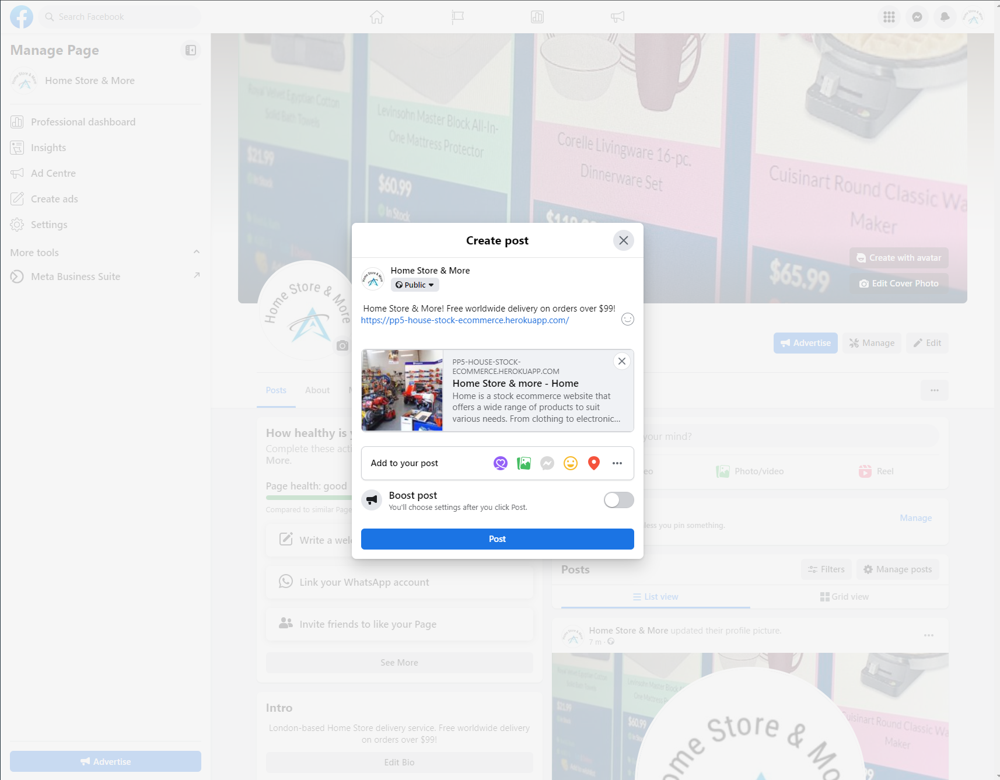
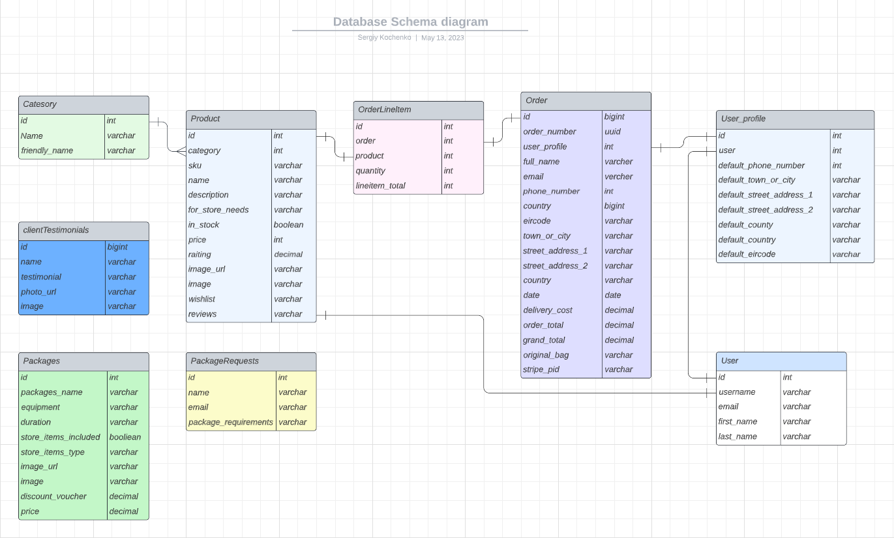
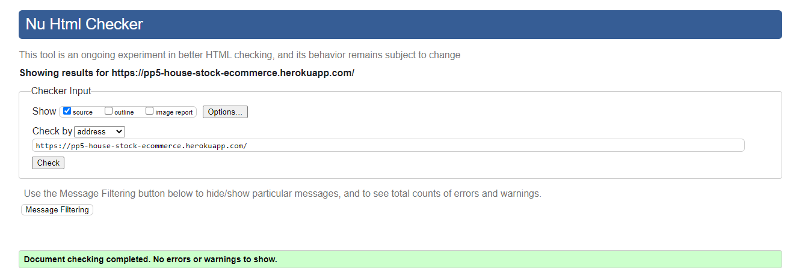
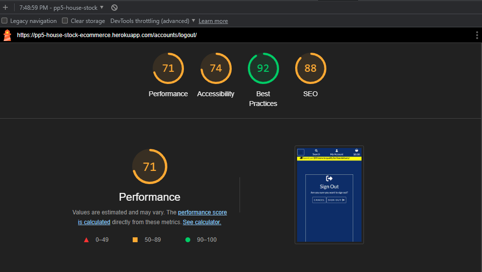

# Portfolio Project 5 - Home Store & More eCommerce Webstore

This repository contains the source code for the Home Store & More eCommerce webstore, a full stack web application developed as a portfolio project for The Code Institute's Full Stack Software Development (eCommerce) Diploma program. The website can be viewed at <https://pp5-house-stock-ecommerce.herokuapp.com/>.

# Overview

Welcome to [Home Store & More](https://pp5-house-stock-ecommerce.herokuapp.com/)
This Website is an e-Commerce Webstore that was designed and developed as an Portfolio Project for The Code Institute's Full Stack Software Development (eCommerce) Diploma programme.

Home Store & More is a demo e-commerce platform showcasing a wide range of affordable, full-stock home products and solutions catering to a diverse and growing target audience. The project demonstrates the developer's proficiency in creating a comprehensive e-commerce solution, with an appealing design, intuitive navigation, and responsive layout.

Please note that this project is for assessment purposes only and does not accept real credit or debit card payments. Any purchases or bookings made on the website will not be fulfilled.

The project is for assessment purposes only and will not accept any genuine credit or debit card payments and any purchases or booking made will not be fullfilled. The [Home Store & More](https://pp5-house-stock-ecommerce.herokuapp.com/) is a full stack, E-commerce, web application offering affordable, full ctock home products and solutions to a growing and diverse target audience.

- User Interface and Design: The website features a visually appealing and modern design, making it easy for users to browse and navigate the site. The layout is responsive, ensuring that the website looks great on various devices, including desktops, laptops, tablets, and smartphones.

- Product Catalog: Home Store & More offers a wide range of home products and solutions, organized into different categories for easy browsing. Users can explore various sections to find the items they're looking for, whether it's home decor, furniture, kitchenware, or other household essentials.
  
- Search Functionality: The website includes a search feature that allows users to quickly find specific products by entering relevant keywords or phrases. This function enhances the overall user experience and helps shoppers locate their desired items with ease.
  
- User Accounts and Authentication: Home Store & More has implemented user account creation and authentication, allowing users to create profiles, save their preferences, and view their order history. This feature demonstrates the developer's ability to integrate essential user management components in an e-commerce platform.
  
- Shopping Cart and Checkout: The website incorporates a shopping cart system that enables users to add products to their cart, review their selections, and proceed to the checkout process. Though it doesn't accept real credit or debit card payments, the website demonstrates the developer's understanding of integrating a seamless and secure checkout experience.
  
- Performance and Optimization: The Home Store & More website is built with performance in mind, ensuring fast load times and an optimized user experience. This aspect showcases the developer's knowledge of best practices in web development and their ability to create a high-performing e-commerce platform.

Overall, the Home Store & More website is a well-rounded e-commerce web application that demonstrates the developer's expertise in full stack web development, specifically in the context of e-commerce. The website is an excellent portfolio project that highlights their proficiency in various aspects of web development, from front-end design to back-end functionality, and provides a strong foundation for potential future projects.

Please use the link below to view the deployed project. If you wish to make a mock purchase, you can use the following details:

- Card Number: 4242424242424242
- Exp Date: Any (future) date using the format MM/YY
- CVN = any 3 digit number
- Postcode = any 5 numerals

Any payments made using an actual payment card will fail and the card will not be charged. No orders made will be fulfilled.

Live project: [Home Store & More](https://pp5-house-stock-ecommerce.herokuapp.com/) app.

The [GitHub repository](https://github.com/SergiyKochenko/pp5-house-stock-ecommerce)

[Back to Table of Contents](#table-of-contents)

# Amiresponsive - "Home Store & More".


## Table of contents

- [Overview](#overview)
  - [Project goals](#project-goals)
  - [Business Plan](#business-plan)
    - [Web Marketing Strategy](#web-marketing-strategy)
      - [Facebook Business page](#facebook-business-page)
      - [MailChimp](#mailchimp)
      - [Hotjar Integration](#hotjar-integration)
  - [UX (User Experience)](#ux-user-experience)
  - [User stories](#user-stories)
  - [Site Administrator goals](#site-administrator-goals)
- [Design Structure](#design-structure)
  - [Color Scheme](#color-scheme)
  - [Functional Structure](#functional-structure)
    - [404 page](#404-page)
    - [403 page](#403-page)
    - [500 page](#500-page)
  - [Wireframes](#wireframes)
    - [For Desktop view](#for-desktop-view)
    - [Wireframes for Mobile view and small screens](#wireframes-for-mobile-view-and-small-screens)
- [Features](#features)
  - [Navbar](#navbar)
  - [Home page](#home-page)
  - [Products page](#products-page)
  - [Product Detail page](#product-detail-page)
  - [Wishlist page](#wishlist-page)
  - [About page](#about-page)
  - [Testimonials page](#testimonials-page)
  - [Hire page](#hire-page)
  - [Packages page](#packages-page)
  - [Footer](#footer)
  - [Basket page](#basket-page)
  - [Checkout page](#checkout-page)
  - [Sign up page](#sign-up-page)
  - [Login page](#login-page)
  - [Responsive design](#responsive-design)
  - [Database Schema](#database-schema)
- [Technologies Used](#technologies-used)
  - [Languages](#languages)
- [Installed Packages](#installed-packages)
- [Frameworks](#frameworks)
- [Database](#database)
  - [Cloud Hosting](#cloud-hosting)
    - [Additional Media Hosting](#additional-media-hosting)
- [Tools](#tools)
- [Bug Reports](#bug-reports)
  - [Fixed Bugs](#fixed-bugs)
  - [Unresolved Bugs](#unresolved-bugs)
- [Testing](#testing)
  - [Manual Testing](#manual-testing)
    - [Device Testing](#device-testing)
    - [Browsers Tested](#browsers-tested)
  - [Automated testing (Unit test)](#automated-testing-unit-test)
  - [Validations](#validations)
    - [HTML Validation](#html-validation)
    - [CSS Validation](#css-validation)
    - [Python Validation (PEP8)](#python-validation-pep8)
    - [Lighthouse report](#lighthouse-report)
- [Deployment](#deployment)
  - [Forking the GitHub Repository](#forking-the-github-repository)
  - [Making a Local Clone](#making-a-local-clone)
- [Credits](#credits)
  - [Code](#code)
  - [Content](#content)
  - [Media](#media)
  - [Contributing](#contributing)
  - [Inspiration](#inspiration)
  - [Acknowledgment](#acknowledgment)

## Project goals

The primary goals of the Home Store & More e-commerce webstore project are:

1. **Portfolio Showcase:** Demonstrate the developer's skills and capabilities in full-stack web development, specifically in the context of e-commerce, as part of The Code Institute's Full Stack Software Development (eCommerce) Diploma program.
   
2. **User Experience:** Create a visually appealing, responsive, and user-friendly web application that offers an intuitive browsing and shopping experience for a diverse and growing target audience.

3. **Product Catalog:** Design a comprehensive product catalog with a wide range of home products and solutions, organized into categories for easy browsing and navigation.
4. **Search and Filter:** Implement search functionality and filtering options, allowing users to quickly locate specific products and tailor their browsing experience according to their preferences.
   
5. **User Accounts and Authentication:** Integrate user account creation and authentication features, enabling users to create profiles, save their preferences, and view their order history.
   
6. **Shopping Cart and Checkout:** Develop a seamless shopping cart system and a simulated checkout process that demonstrates the understanding and implementation of a secure and user-friendly e-commerce transaction flow.
   
7. **Performance and Optimization:** Optimize the website for performance and fast load times, ensuring a smooth and enjoyable user experience.
   
8. **Scalability and Extensibility:** Build a solid foundation that allows for future expansion and refinement, making it possible to add new features, products, and functionalities as the platform grows.

## Business Plan

1. Executive Summary
Project Name: PP5 Home Store & More  E-commerce Website
[Website:](https://pp5-house-stock-ecommerce.herokuapp.com/) PP5 Home Store & More the E-commerce Website is designed to provide customers with an easy and convenient way to purchase household items and supplies online. My website offers a wide range of products at competitive prices, with an emphasis on customer satisfaction and user experience.

2. Objectives
Establish a user-friendly online platform for customers to purchase household items and supplies.
Offer a wide variety of products, ensuring a diverse and competitive inventory.
Prioritize customer satisfaction through exceptional user experience and responsive customer service.
Achieve steady growth in customer base, revenue, and market share.

3. Business Description

a. Company Overview

PP5 Home Store & More E-commerce is an online platform that caters to customers seeking household items and supplies. The platform offers a vast selection of products, ranging from cleaning supplies to home décor. Our primary goal is to provide a seamless shopping experience that leaves customers satisfied and eager to return.

b. Target Market

My target market includes:

- Homeowners and renters seeking household items and supplies.
- Busy individuals who prefer online shopping for its convenience.
- Environmentally conscious customers seeking eco-friendly and sustainable products.

4. Products & Services
PP5 Home Store & More E-commerce offers the following product categories:

- Cleaning supplies
- Home decor
- Clothes
- Kitchenware
- Home appliances
- Storage solutions
- Home improvement tools
- Outdoor and garden supplies
- Eco-friendly and sustainable products

5. Marketing & Sales Strategy

a. Online Presence & Branding

- Develop a visually appealing and user-friendly website.
- Optimize the website for search engines (SEO) to increase organic traffic.
- Create and maintain social media profiles to engage with customers and promote products.

b. Advertising & Promotion

- Utilize targeted online advertising (Facebook Ads) to reach potential customers.
- Offer promotions and discounts to incentivize first-time customers and encourage repeat business.
- Collaborate with influencers and bloggers for product reviews and endorsements.

c. Customer Retention & Loyalty

- Implement a rewards/loyalty program to encourage repeat purchases.
- Offer personalized product recommendations based on customer preferences and browsing history.
- Provide exceptional customer service, including responsive support and hassle-free returns.

6. Operations & Management

a. Inventory Management

- Utilize an inventory management system to track stock levels and reorder products as necessary.
- Develop relationships with reliable suppliers to ensure product availability and timely delivery.

b. Order Fulfillment & Shipping

- Offer multiple shipping options, including expedited and international shipping.
- Partner with reliable shipping carriers to ensure timely and accurate delivery of orders.

c. Customer Support

- Provide customer support through multiple channels, including email, phone, and live chat.

7. Financial Projections

- Develop detailed financial projections for the first three years of operation, including revenue, expenses, and net income.
- Regularly review and adjust financial projections based on actual performance and market trends.

8. Risk Management & Contingency Plan

- Identify potential risks and develop contingency plans to address them.
- Monitor market trends and competitors to identify emerging opportunities and threats.
- Establish a reserve fund to cover unexpected expenses and mitigate financial risks.

9. Milestones & Timeline

- Launch the platform within six months, followed by ongoing development and improvement.
- Achieve a steady growth in customer base and revenue within the first year of operation.
- Expand product offerings and market reach within the first two years of operation.

10. Expansion Plan

As the business grows and achieves its initial milestones, I will consider the following expansion opportunities:

a. Product Line Expansion

- Continuously explore new product categories and trends to diversify our offerings.
- Collaborate with local artisans and small businesses to offer unique and exclusive products.

b. Geographic Expansion

- Analyze market demand and shipping logistics to identify potential new markets for expansion.
- Localize the website and marketing efforts to cater to the preferences and needs of customers in new markets.

c. Technology & Innovation

- Invest in cutting-edge technologies to enhance the user experience, such as augmented reality (AR) product visualization and AI-powered recommendations.
- Explore opportunities to integrate with smart home devices and platforms for seamless product integration and usage.

11. Exit Strategy

In the event that the business needs to pivot or the founders decide to exit, we will consider the following options:

a. Merger or Acquisition

- Identify potential strategic partners or larger e-commerce platforms that may be interested in acquiring the business.

b. Management Buyout

- Enable the existing management team to buy the shares of the company and take control of the business operations.

c. Initial Public Offering (IPO)

- If the business achieves significant growth and market share, consider going public to raise additional capital and provide liquidity for shareholders.

12. Conclusion

The PP5 Home Store E-commerce Website aims to become a trusted and convenient destination for customers seeking household items and supplies. By prioritizing customer satisfaction, offering a diverse and competitive product selection, and continuously improving our online website, I believe I can achieve long-term success and growth in the competitive e-commerce market.


[Back to Table of Contents](#table-of-contents)

## Web Marketing Strategy

The PP5 E-Commerce website aims to attract and convert visitors into customers by implementing a comprehensive web marketing strategy that focuses on the following key channels and tactics:

1. **Search Engine Optimization (SEO)**: Improve the website's organic search ranking by optimizing content, structure, and technical aspects for search engines.

2. **Content Marketing**: Create engaging and informative content, such as blog posts and articles, to attract potential customers and establish the website as an industry authority.

3. **Social Media Marketing**: Engage with users on popular social media platforms to promote content, share updates, and build brand awareness.

4. **Email Marketing**: Utilize email campaigns to keep subscribers informed about promotions, new products, and other updates.

5. **Influencer Marketing**: Partner with influencers in the home equipment and decor niche to reach a larger audience and boost brand visibility.

6. **Affiliate Marketing**: Encourage partners to promote the website and its products through an affiliate program.

7. **Conversion Rate Optimization (CRO)**: Continuously optimize the website's design, user experience, and calls-to-action to improve conversion rates.

By implementing this web marketing strategy, the PP5 House Stock E-Commerce website aims to increase online visibility, drive more traffic, and ultimately boost sales and revenue.

## Facebook Business page

Creating a Facebook Business Page can be an important step in your business's social media marketing strategy. It allows your business to have a public presence on Facebook, providing a space for you to share updates, post about products or services, engage with customers, and reach new audiences.

Here's a step-by-step guide on how to create a Facebook Business Page:

1. Log in to Facebook:

If you don't already have a personal Facebook account, you'll need to create one first. Facebook requires every business page to be linked to a personal account for admin purposes.

2. Create a Page:

Once you're logged in, go to the "Pages" section in the main menu (on the left side of your home page). Click on "Create New Page".

3. Choose a Page Type:

You'll be asked to choose a category for your page. The most common choice is "Business or Brand". Click on "Get Started" under your chosen category.

4. Fill Out Information:

Now, you'll need to provide some information about your business, including:

- Page Name: This will be the name of your Business Page on Facebook. It should match or closely align with the name of your business.
Category: Type a word or two that describes your business, and Facebook will suggest some options. Choose the one that fits your business best.
- Description: Write a short description of your business (up to 255 characters). This should be a brief outline of what your business does.
- Website (optional): If you have a business website, you can include it here.

5. Add a Profile Picture and Cover Photo:

Add a profile picture for your Business Page. This is often your company logo. Then, add a cover photo. This is a larger, banner-style photo that appears at the top of your page. It should relate to your business in some way and be engaging.

6. Add More Details:

After creating your page, fill in additional details in the "About" section, such as:

- Contact information: Include phone numbers, email addresses, your website, etc.
- Location: If you have a physical store or office, put your address here.
- Hours: If applicable, fill in the hours of operation.
- Price range: This can give potential customers an idea of your pricing structure.

Create Your First Post:

Now your page is set up, it's a good time to create your first post. This can be a simple welcome message, an introduction of your business, or anything else that you feel would be appropriate for your new Facebook audience.

8. Invite People to Like Your Page:

Facebook will prompt you to invite people to like your new Business Page. Start with your personal Facebook friends who are likely to be interested in your business, and then expand from there.

Remember, Facebook is often the first place a customer goes to get information about a business, so having all your information up to date and easy to find is very important. Once your page is set up, you can start posting updates, sharing content, and interacting with your customers!

<br>

<details>
<summary>See screenshots of my  Facebook business page </summary>





</details>

Link to [Facebook business page:](https://www.facebook.com/profile.php?id=100092638811901) that was created for the website.

<br>

## MailChimp

### **MailChimp Integration for PP5 E-commerce:**

MailChimp is a powerful marketing platform that helps businesses manage their email marketing campaigns, subscriber lists, and automation workflows. 
<br>By integrating MailChimp with our PP5 E-commerce website, we can enhance user engagement, manage mailing lists, and keep customers 
<br>informed about new products, promotions, and important updates.

**Key Features**
1. **Email Marketing:** Easily create, send, and track personalized email campaigns to promote your products and services, ensuring that your customers stay informed and engaged.
2. **Subscriber Management:** Manage your subscribers' data, segment them based on their preferences, and create targeted campaigns for better conversion rates.
3. **Automation:** Set up automated workflows to send personalized and timely messages, such as welcome emails for new subscribers or abandoned cart reminders.
4. **Analytics and Reporting:** Track the performance of your email campaigns through detailed analytics, helping you make informed decisions to optimize your marketing efforts.
5. **Signup Forms:** Embed customizable signup forms on your website, enabling visitors to subscribe to your mailing list with ease.

**Integration Steps**
To integrate MailChimp with the PP5 E-commerce website, follow these steps:
1. Sign up for a MailChimp account or log in to your existing account.
2. Obtain your API key from the MailChimp dashboard.
3. In the PP5 House Stock E-commerce website's admin panel, navigate to the MailChimp integration settings.
4. Enter the API key in the designated field and save the settings.
5. Configure the integration settings, such as the audience list, email templates, and automation triggers.
6. Embed the MailChimp signup form on your website's front-end to enable users to subscribe to your mailing list.
7. Test the integration by sending a test email and verifying that it's correctly delivered to your subscribers.

**Support and Resources**
For more information about MailChimp and its features, visit the official MailChimp website (https://mailchimp.com/) and their knowledge base (https://mailchimp.com/help/).

**By integrating MailChimp with the PP5 E-commerce website, I can leverage the power of email marketing to build strong relationships with my customers and increase sales.**

<br>

## Hotjar Integration

<br>

This project integrates [Hotjar](https://www.hotjar.com/), a powerful tool that combines analysis and feedback tools to understand how users interact with [Home Store & More](https://pp5-house-stock-ecommerce.herokuapp.com/) website.

Hotjar provides heatmaps, session recordings, and surveys to gain a clear picture of our users' needs, desires, and behavior. This comprehensive understanding helps us optimize the user experience and performance of the [Home Store & More](https://pp5-house-stock-ecommerce.herokuapp.com/) website.

**Features Utilized** <br>
- **Heatmaps:** Visual representation of users' clicks, taps, and scrolling behavior.
- **Visitor Recordings:** Watch actual browsing actions performed by users on the site.
- **Conversion Funnels:** Identify on which page and at which step most visitors are leaving the site.
- **Form Analysis: Discover** which fields take too long to fill, which are left blank, and why the visitors abandon the form and page.<br>

**For more detailed information on how to use Hotjar and how it benefits the project, please visit the [Hotjar](https://www.hotjar.com/) website.**

[Back to Table of Contents](#table-of-contents)

<hr>

## UX (User Experience)


UX, or User Experience, refers to the overall experience a user has while interacting with a product, service, or website. It encompasses various aspects of design, functionality, and usability to create a seamless and enjoyable experience for users. Here are some key elements to consider when creating a positive UX for the Home Store & More e-commerce webstore:

1. **Intuitive Navigation:** Design a clear and consistent navigation structure that allows users to easily move between different sections of the website. This can be achieved by using a well-organized menu with easy-to-understand labels and logical categorization of products and content.
   
2. **Responsive Design:** Ensure that the website looks and functions well on various devices and screen sizes, including desktops, laptops, tablets, and smartphones. This can be achieved by using responsive design techniques, such as fluid grids, flexible images, and media queries.
   
3. **Clear and Consistent Visual Hierarchy:** Establish a visual hierarchy that guides users through the content and makes it easy for them to understand the layout and organization of the website. Use consistent typography, color schemes, and design elements throughout the site to create a cohesive look and feel.

4. **Effective Search and Filtering:** Implement a search feature that allows users to quickly find specific products and content. Additionally, provide filtering options so users can refine their search results and browse products based on their preferences and requirements.
   
5. **Informative Product Pages:** Design detailed and informative product pages that provide users with all the necessary information to make informed purchase decisions. Include high-quality images, clear product descriptions, specifications, pricing, and customer reviews.
   
6. **User-friendly Forms:** Create simple and user-friendly forms for user registration, login, and checkout processes. Use clear labels, intuitive input fields, and helpful error messages to guide users through the process and minimize friction.
   
7. **Load Time Optimization:** Optimize the website's performance to ensure fast load times and a smooth user experience. This can be achieved by compressing images, minifying CSS and JavaScript files, and utilizing caching techniques.
   
8. **Accessibility:** Design the website with accessibility in mind, ensuring that users with disabilities can access and interact with the content. This can be achieved by using semantic HTML, proper color contrast, keyboard navigation support, and screen reader-friendly content.
   
By considering these aspects and focusing on creating a positive user experience, the Home Store & More e-commerce webstore will be more likely to engage users, encourage repeat visits, and ultimately drive conversions and sales

<hr>

## User stories

See the GitHub Projects section was used as a [Kanban board](https://github.com/users/SergiyKochenko/projects/14) for the development of this project, which made it possible to break down the project execution into subtasks and make it easier to complete and track project progress.
[User stories](https://github.com/users/SergiyKochenko/projects/14) were used to break down the project into sub-tasks and placed on the Kanban board to work on them and track progress.

<hr>

## Site Administrator goals

Site Administrator Goals for the Home Store & More e-commerce webstore:

1. **Efficient Product Management:** Implement an easy-to-use and efficient product management system, allowing the site administrator to add, edit, and remove products, as well as manage product categories and inventory.
   
2. **Order Management:** Develop a comprehensive order management system that enables the site administrator to monitor and manage customer orders, track shipping statuses, and handle returns or refunds when necessary.
3. **User Management:** Implement a user management system that allows the site administrator to manage registered users, monitor user activity, and address any reported issues or concerns.
   
4. **Secure Payment Processing:** Ensure the secure handling and processing of payment information, even though the website currently does not accept real transactions, to demonstrate a commitment to security and data protection.
   
5. **Marketing and Promotion:** Facilitate the creation and management of marketing campaigns and promotions, such as discounts, special offers, and email marketing, to drive traffic and increase sales.
   
6. **Content Management:** Implement an easy-to-use content management system (CMS) that allows the site administrator to update and maintain the website's content, including banners, blog posts, and static pages.

7. **Customer Support:** Develop a system for managing customer inquiries, complaints, and feedback, enabling the site administrator to provide timely and effective support to users.
   
8. **System Maintenance and Updates:** Ensure regular system maintenance and updates to keep the website running smoothly, address any potential security vulnerabilities, and implement new features and improvements as needed.

9. **Scalability and Performance:** Monitor and optimize the website's performance and infrastructure to ensure fast load times and a smooth user experience, as well as plan for scalability to accommodate future growth.

By focusing on these goals, the site administrator can effectively manage and maintain the Home Store & More e-commerce webstore, ensuring a positive experience for both users and the website's stakeholders.

## Design Structure

Design Structure for the Home Store & More e-commerce webstore:

1. Header: The header section should include the website's logo, a search bar, user account options (login, register, account settings), and a shopping cart icon with the number of items in the cart. Additionally, a responsive navigation menu should be present, featuring the main product categories and any other essential pages, such as "About Us" or "Contact."
2. Homepage: The homepage should feature a large, attention-grabbing banner or carousel showcasing popular or new products, special offers, or seasonal promotions. Below the banner, display a selection of featured products and categories, along with any relevant promotional material. Consider including a section for customer reviews or testimonials to build trust with potential buyers.
3. Product Listing Page: Design a clean and organized layout for the product listing page, displaying products in a grid format with clear images, product names, prices, and a brief description. Include pagination for easy browsing, as well as filtering and sorting options to help users find what they're looking for quickly.
4. Product Detail Page: The product detail page should include high-quality images of the product, a clear title, price, and availability information. Provide a detailed description, specifications, and any additional product information. Include an "Add to Cart" button, and display related products or upsell items to encourage additional purchases.
5. Shopping Cart Page: Create a clear and organized layout for the shopping cart page, displaying the selected products with images, names, prices, and quantities. Allow users to update the quantity or remove items from their cart, and display the subtotal, shipping fees, taxes, and total amount. Include a "Proceed to Checkout" button, as well as options to continue shopping or save the cart for later.
6. Checkout Page: Design a simple and user-friendly checkout process, with clear input fields for shipping and billing information, as well as a summary of the order details. Offer options for guest checkout or user registration, and provide a clear indication of the payment process and security measures in place.
7. User Account Dashboard: Create an organized dashboard for registered users, displaying options to view and edit account information, manage shipping addresses, view order history, and access any other relevant features.
8. Footer: The footer section should include links to important pages, such as "Terms & Conditions," "Privacy Policy," and "Return Policy." Also, provide contact information, social media icons, and a newsletter signup form for users who want to stay updated on promotions and news.

By following this design structure, the Home Store & More e-commerce webstore will provide a visually appealing, user-friendly, and seamless browsing and shopping experience for users, ultimately driving conversions and sales.

<br/>

[Back to Table of Contents](#table-of-contents)

### Color Scheme

A well-chosen color scheme for the Home Store & More e-commerce webstore will create a visually appealing and cohesive user experience. Here is a proposed color scheme for the website:


By implementing this color scheme, the Home Store & More e-commerce webstore is creating a visually appealing and user-friendly experience for its visitors. These colors works together to establish a professional and trustworthy appearance, which is essential for an e-commerce website.
<details>
<summary>Color palette generator </summary>


</details>

<hr/>
<br>

### Functional Structure
<br>

1. **Home Page:**<br>
This is the main entry point of the website. It usually features a summary of what the website offers, featured products, and links to different parts of the website.

2. **Product Listing/Catalogue:**<br>
This is where all the products are listed, usually with options to filter and sort the products based on various criteria such as price, category, brand, etc.

3. **Product Detail Pages:**<br>
Each product should have its own detailed page, featuring more information about the product, including images, descriptions, specifications, customer reviews, and pricing.

4. **Shopping Cart:**<br>
Here, customers can review the items they've added to their cart, adjust quantities, see the total price, and proceed to checkout.

5. **Checkout Process:**<br>
This is a series of pages or a single page where customers enter their shipping information, select a payment method, review their order, and finalize the purchase.

6. **User Account:**<br>
This section allows users to register, log in, and manage their account details. It often includes order history, saved payment methods, and personal details.

7. **Customer Service/Help Center:**<br>
This includes FAQs, contact information, shipping and return policies, and other useful resources for customers.

8. **About Us:**<br>
This section provides information about the company, its history, mission, and values.

9. **Search Function:**<br>
A search bar is typically included at the top of every page, allowing users to search for specific items throughout the website.

10. **Contact Us:**<br>
This page provides the contact form method for customers to contact your business.

11. **Hire:**<br>
The business offers services for hire, this page detail the types of services, rates, availability, and the process for hiring.

12. **Testimonials:**<br>
This page showcase reviews or testimonials from previous customers to build trust with prospective customers.

13. **Footer:**<br>
The website footer is found at the bottom of each page and typically includes links to legal information (like terms of service and privacy policy), social media profiles, contact information, and sometimes a signup form for a newsletter.

### 404 page

The 404 page is an essential part of any website, as it serves as the error page displayed when a user attempts to visit a non-existent URL or encounters a broken link. A well-designed 404 page can help retain users and guide them back to the main site, rather than losing them due to frustration or confusion.

- For the Home Store & More e-commerce webstore, the 404 page should include the following design elements and features:
  1. **Clear Error Message:** Display a prominent and clear error message indicating that the requested page could not be found (e.g., "Oops! Page Not Found" or "404 Error: Page Not Found").
   
  2. **Consistent Design:** Maintain consistency in design, typography, and color scheme with the rest of the website to ensure a cohesive user experience and reinforce branding.
   
  3. **Helpful Suggestions:** Offer helpful suggestions or tips for users to find what they are looking for, such as checking the entered URL for typos, using the search function, or browsing through the main product categories.
  
  4. **Navigation Options:** Provide clear and easy-to-find navigation options, such as a search bar, links to popular categories or pages, and a button or link to return to the homepage. This will help guide users back to the main site and encourage them to continue browsing.
  
  5. **Engaging Visuals:** Consider using engaging visuals or illustrations related to the 404 error to inject a sense of humor or lightheartedness into the page, helping to alleviate user frustration and create a positive impression.
  
  6. **Responsive Design:** Ensure that the 404 page is responsive and looks good on various devices and screen sizes.
   
By incorporating these design elements and features, the 404 page for the Home Store & More e-commerce webstore will not only inform users of the error but also help guide them back to the main site, improving user experience and reducing bounce rates.

### 403 page

The 403 page is an important component of a website, as it serves as the error page displayed when a user attempts to access a restricted or forbidden resource. A well-designed 403 page can inform users about the issue and guide them to appropriate actions, rather than leaving them confused or frustrated.

1. **Clear Error Message:** Display a prominent and clear error message indicating that the user does not have permission to access the requested resource (e.g., "Access Denied" or "403 Error: Forbidden").

2. **Consistent Design:** Maintain consistency in design, typography, and color scheme with the rest of the website to ensure a cohesive user experience and reinforce branding.

3. **Explanation:** Provide a brief explanation of why the user might be seeing the 403 error, such as not being logged in, not having the necessary permissions, or trying to access a restricted area.

4. **Actionable Steps:** Offer actionable steps that users can take to resolve the issue, such as logging in, registering for an account, or contacting support for assistance.

5. **Navigation Options:** Provide clear and easy-to-find navigation options, such as a search bar, links to popular categories or pages, and a button or link to return to the homepage. This will help guide users back to the main site and encourage them to continue browsing.

6. **Engaging Visuals:** Consider using engaging visuals or illustrations related to the 403 error to convey the message in a more approachable manner and create a positive impression.

7. **Responsive Design:** Ensure that the 403 page is responsive and looks good on various devices and screen sizes.

By incorporating these design elements and features, the 403 page for the Home Store & More e-commerce webstore will effectively inform users about the access issue and guide them to appropriate actions, improving user experience and maintaining a professional appearance.

### 500 page

The 500 page is a crucial component of a website, as it serves as the error page displayed when a server-side error occurs. A well-designed 500 page can inform users about the issue and reassure them that the problem is being addressed, rather than leaving them frustrated or confused.

1. **Clear Error Message:** Display a prominent and clear error message indicating that there has been a server-side error (e.g., "Oops! Something went wrong" or "500 Error: Internal Server Error").

2. **Consistent Design:** Maintain consistency in design, typography, and color scheme with the rest of the website to ensure a cohesive user experience and reinforce branding.

3. **Explanation:** Provide a brief explanation of the issue, informing users that the server encountered an error while processing their request.

4. **Reassurance:** Reassure users that the issue is temporary and that the website's team is aware of the problem and working to resolve it as soon as possible.

5. **Navigation Options:** Provide clear and easy-to-find navigation options, such as a search bar, links to popular categories or pages, and a button or link to return to the homepage. This will help guide users back to the main site and encourage them to continue browsing.

6. **Engaging Visuals:** Consider using engaging visuals or illustrations related to the 500 error to convey the message in a more approachable manner and create a positive impression.

7. **Contact Information:** Provide contact information or a link to the support page, encouraging users to report the issue if it persists or if they need further assistance.

8. **Responsive Design:** Ensure that the 500 page is responsive and looks good on various devices and screen sizes.

By incorporating these design elements and features, the 500 page for the Home Store & More e-commerce webstore will effectively inform users about the server-side issue, reassure them that the problem is being addressed, and guide them to appropriate actions or alternative options, improving user experience and maintaining a professional appearance.

[Back to Table of Contents](#table-of-contents)

## Wireframes

Wireframes are an essential part of the design process, as they help visualize the layout and structure of a website before development begins. They are typically low-fidelity, focusing on the placement and organization of elements, rather than visual design or colors.

Here is a structure for created wireframes for the Home Store & More webstore.
The wireframes were slightly modified during the actual creation of the project, 
e.g. with pages installed removed form for user convenience and better UX.

The wireframes can be seen below:

### For Desktop view

1. **Homepage:** Include a header with the logo, search bar, user account options, and navigation menu. Feature a large banner or carousel, followed by sections showcasing featured products, categories, and promotions. Optionally, include a section for customer testimonials or reviews.
<details>
<summary>Screenshot</summary>

 
</details>
<hr>

2. **Product Listing Page:** Design a clean layout with a grid of products, including images, titles, prices, and brief descriptions. Add pagination, filtering, and sorting options for easy browsing.
<details>
<summary>Screenshot</summary>

 
</details>
<hr>

3. **Product Detail Page:** Display high-quality product images, title, price, and availability information. Include a detailed description, specifications, and an "Add to Cart" button. Optionally, showcase related products or upsell items.
<details>
<summary>Screenshot</summary>

 
</details>
<hr>

4. **Shopping Cart Page:** Present a clear layout of the selected products with images, titles, prices, and quantities. Allow users to update quantities or remove items, and display the subtotal, shipping fees, taxes, and total amount. Include a "Proceed to Checkout" button and options to continue shopping or save the cart for later.
<details>
<summary>Screenshot</summary>

 
</details>
<hr>

5. **Checkout Page:** Design a simple and user-friendly checkout process with input fields for shipping and billing information and a summary of the order details. Offer guest checkout or user registration and provide clear indications of the payment process and security measures.
<details>
<summary>Screenshot</summary>

 
</details>
<hr>

6. **User Account Dashboard:** Create a dashboard for registered users with options to view and edit account information, manage shipping addresses, view order history, and access other relevant features.
<details>
<summary>Screenshot</summary>

 
</details>
<hr>

7. **Hire Page:** Design a page dedicated to offering professional services, such as interior design, furniture assembly, or home improvement consultations. Include the following sections:
<details>
<summary>Screenshot</summary>

 
</details>
<hr>

a. **Service Categories:** Display a grid or list of the different services offered, along with a brief description and an eye-catching image or icon for each category.

b. **How It Works:** Describe the process for hiring professionals through the website, such as submitting a request, receiving quotes, selecting a service provider, and making payments. Use clear and concise steps with accompanying visuals.

c. **Testimonials and Reviews:** Showcase positive feedback from previous customers who have used the website's hiring services. This can help build trust and credibility with potential clients.

8. **Packages Page:** Design a page dedicated to showcasing pre-selected or custom package deals, such as furniture sets, home decor bundles, or appliance combinations. Include the following sections:

<details>
<summary>Screenshot</summary>

 
</details>
<hr>

a. **Featured Packages:** Display a grid or list of the featured packages, including images, titles, descriptions, and prices. Highlight any discounts or special offers associated with these packages.

b. **Custom Packages:** Offer users the option to create their own custom packages by selecting products from different categories. Provide an interactive interface where users can add, remove, or modify items in their custom package and see the updated price.

c. **Why Choose Our Packages:** Emphasize the benefits of purchasing packages, such as discounted prices, cohesive design, or hassle-free shopping experience. Use clear messaging and visuals to communicate these advantages.

d. **Customer Testimonials:** Showcase positive feedback from customers who have purchased packages from the website. This can help build trust and encourage potential clients to explore package options.


9. **About Page:** Design a page that shares the story, mission, and values of the Home Store & More e-commerce webstore. Include the following sections:
<details>
<summary>Screenshot</summary>

 
</details>
<hr>

a. **Our Story:** Provide a brief history of the company, its founders, and its journey to becoming an e-commerce webstore. Use engaging storytelling to connect with users on a personal level.

b. **Mission and Values:** Clearly articulate the company's mission and core values, emphasizing its commitment to customer satisfaction, product quality, and social responsibility.

c. **Team:** Showcase the key members of the company, including their photos, names, titles, and a brief bio. This can help humanize the brand and create a sense of trust with users.

d. **Why Shop With Us:** Highlight the unique selling points of the Home Store & More webstore, such as a wide product selection, competitive prices, or exceptional customer service. Use visuals and clear messaging to communicate these advantages.

e. **Press and Awards:** Mention any press coverage, industry recognition, or awards the company has received. This can help build credibility and authority in the market.

f. **Community Involvement:** Showcase any charitable initiatives or community projects the company has been involved in, demonstrating its commitment to social responsibility.

8. **404, 403, and 500 Error Pages:** Design error pages that clearly communicate the issue, offer helpful suggestions or actionable steps, and provide navigation options to guide users back to the main site.
<details>
<summary>Screenshot</summary>

 
</details>
<hr>

[Back to Table of Contents](#table-of-contents)

### Wireframes for Mobile view and small screens


1. **Homepage:**
<details>
<summary>Screenshot</summary>

 
</details>
<hr>

2. **Product Listing Page:** 
<details>
<summary>Screenshot</summary>

 
</details>
<hr>

3. **Product Detail Page:**
<details>
<summary>Screenshot</summary>

 
</details>
<hr>

4. **Shopping Cart Page:** 
<details>
<summary>Screenshot</summary>

 
</details>
<hr>

5. **Checkout Page:** 
<details>
<summary>Screenshot</summary>

 
</details>
<hr>

6. **User Account Dashboard:** 
<details>
<summary>Screenshot</summary>

 
</details>
<hr>

7. **Hire Page:** 
<details>
<summary>Screenshot</summary>

 
</details>
<hr>

8. **Packages Page:**
<details>
<summary>Screenshot</summary>

 
</details>
<hr>

9. **About Page:** 
<details>
<summary>Screenshot</summary>

 
</details>
<hr>

10. **Testimonials** 
<details>
<summary>Screenshot</summary>

 
</details>
<hr>

11. **404, 403, and 500 Error Pages:** 
<details>
<summary>Screenshot</summary>

 
</details>
<hr>

[Back to Table of Contents](#table-of-contents)

## Features

1. **User-friendly Interface:** My website boasts a clean, intuitive design that makes navigation a breeze, ensuring a seamless and enjoyable shopping experience.

2. **Comprehensive Product Catalog:** Browse our extensive range of innovative equipment and supplementary products, curated to enhance your home or event space.

3. **Secure E-commerce Platform:** Shop with confidence on our secure e-commerce platform, featuring encrypted payment processing and robust data protection measures.

4. **Customizable Packages:** Choose from our pre-designed packages or create a custom solution tailored to your specific needs, ensuring a personalized experience for every occasion.

5. **Informative Product Descriptions:** Access detailed product descriptions, specifications, and images to help you make informed purchasing decisions.

6. **Customer Testimonials:** Read reviews and testimonials from our satisfied customers, providing valuable insights into the quality of our products and services.

7. **Responsive Customer Support:** Connect with our dedicated customer support team, ready to assist you with any questions or concerns throughout your shopping journey.

8. **Worldwide Shipping:** Enjoy the convenience of our worldwide shipping options, ensuring timely delivery of your purchases no matter where you are located.

### Navbar

- **Home:** Click to return to the homepage at any time, providing a starting point for browsing our website and exploring our products and services.

- **Products:** Access our comprehensive product catalog, showcasing our innovative equipment and supplementary products designed to enhance your home or event space.

- **Packages:** Explore our pre-designed and custom package options, tailored to meet the unique needs of various occasions and celebrations.

- **Testimonials:** Read reviews and testimonials from our satisfied customers, offering valuable insights into the quality of our products and services.

- **Blog:** Visit our blog for expert advice, tips, and inspiration on how to make the most of our products and services in your home or event space.

- **Contact Us:** Reach out to our dedicated customer support team with any questions or concerns, or to request a custom package tailored to your specific needs.

- **My Account:** Log in or create an account to access your order history, manage your personal information, and track your orders with ease.

- **Shopping Cart:** View your selected items, manage your order, and proceed to our secure checkout process to complete your purchase.

- **Search:** Utilize our integrated search feature to quickly find products or content on our website, making your shopping experience more efficient and enjoyable.

---

### Home page

The Home Page of the PP5 E-Commerce website serves as the main entry point for users and provides an engaging and visually appealing overview of the site's features and offerings. Key elements of the Home Page include:

- **Header:** The header contains the website logo, navigation menu, and user authentication options (login, signup, and logout). It allows users to navigate the website easily and access various sections such as products, testimonials, equipment hire, and more.

- **Featured Products:** A showcase of selected products, highlighting popular or new items available in the store. This section helps draw users' attention to specific products and encourages them to explore the store's offerings.

- **Promotional Banners:** Eye-catching banners that display promotions, discounts, or special announcements. These banners help inform users of ongoing sales or events and can drive engagement with the website.

- **News & Updates:** This section highlights the latest news, updates, or blog posts related to the store or its products. Keeping users informed about the latest developments helps build trust and encourages repeat visits.

- **Testimonials:** A display of customer testimonials, showcasing positive experiences and feedback from satisfied customers. This section helps build credibility and trust in the store's products and services.

- **Footer:** The footer contains additional navigation links, contact information, and social media icons. It helps users find important information quickly and easily and allows them to connect with the store on various social platforms.

The Home Page is designed to provide a welcoming and informative experience for users, guiding them through the website and encouraging interaction with the store's products and services.

<details>
<summary>Screenshots</summary>


</details>

---
### Products page

- **Product Categories:** A list of organized product categories, allowing customers to easily navigate and browse our extensive range of innovative equipment and supplementary products.
- **Product Availability:** Essential information about product availability, ensuring customers have a clear understanding of the product in stock.
- **Add to Wishlist:** An option for customers to save the product to their wishlist for future reference, making it simple to return to items they are interested in.
- **Product Images:** High-quality images that showcase the product, allowing customers to view the item in detail and make informed purchasing decisions.
- **Price Details:** Display the current price of the product, as well as giving customers a clear overview of the item's cost.

The product page of Home Store & More + Techno Tech Co. Ltd's website is designed to provide a comprehensive and engaging shopping experience, making it easy for customers to find, compare, and purchase the perfect products to enhance their home or event space:
<details>
<summary>Screenshots</summary>


</details>

---
### Products Detail page

- **Detailed Product Information:** Comprehensive product descriptions, specifications, and images, helping customers make informed purchasing decisions based on their needs and preferences.
- **Customer Reviews and Ratings:** Real-life experiences and ratings from customers who have purchased and used the products, offering valuable insights into the quality and performance of each item.
- **Add to Cart Button:** A prominent and easy-to-use button that allows customers to quickly add products to their shopping cart and continue browsing the website.
- **Add to Wishlist:** An option for customers to save the product to their wishlist for future reference, making it simple to return to items they are interested in.
- **Product Images:** High-quality images that showcase the product, allowing customers to view the item in detail and make informed purchasing decisions.
- **Product Availability:** Essential information about product availability, ensuring customers have a clear understanding of the product in stock.
- **Price Details:** Display the current price of the product, as well as giving customers a clear overview of the item's cost.

The product detail page of Home Store & More + Techno Tech Co. Ltd's website is designed to provide customers with all the information they need to make an informed purchasing decision, offering a comprehensive and engaging shopping experience:

<details>
<summary>Screenshots</summary>


</details>

---
### Wishlist page

- **Wishlist Feature:** An option for customers to save their favorite products for future reference, making it simple to return to items they are interested in.
- **User-friendly Interface:** An intuitive design that makes it easy for customers to view, manage, and interact with their saved items on the wishlist page.
- **Product Thumbnails:** Visual representations of saved products, complete with images, product names, and brief descriptions, allowing customers to quickly recognize and review their saved items.
- **Add to Cart Button:** A convenient button next to each product that enables customers to add items directly from their wishlist to their shopping cart, streamlining the purchasing process.
- **Remove from Wishlist:** An option for customers to remove items from their wishlist, decluttering the list and keeping it up-to-date with their current preferences.
- **Product Availability Indicator:** A clear indication of each product's availability status, helping customers decide when to proceed with their purchase.
- **Price Information:** Display the current price of each saved product, allowing customers to make informed purchasing decisions and keep track of any changes in pricing.
- **Mobile Compatibility:** A responsive design that ensures the wishlist page is accessible and user-friendly on various devices, such as smartphones and tablets, for a seamless browsing experience.

The wishlist page of Home Store & More + Techno Tech Co. Ltd's website is designed to provide a convenient and personalized shopping experience, allowing customers to save, manage, and purchase their favorite products with ease:

<details>
<summary>Screenshots</summary>


</details>

---
### About page

- **Company Overview:** A detailed introduction to Home Store & More + Techno Tech Co. Ltd, highlighting our mission, values, and unique selling points.
- **Company History:** A timeline or narrative outlining the milestones and significant events in our company's journey since its inception, showcasing our growth and achievements.
- **Team Profiles:** An introduction to our experienced team members, highlighting their expertise and roles within the company, fostering trust and connection with our customers.
- **Core Values:** A presentation of our company's core values and principles, demonstrating our commitment to excellence, innovation, and customer satisfaction.
- **Customer Testimonials:** A curated selection of customer testimonials that emphasize the positive experiences and quality of our products and services.
- **Partners and Collaborators:** A showcase of our strategic partners and collaborators, emphasizing our commitment to working with leading industry professionals and organizations.
- **Sustainability and Social Responsibility:** Information about our company's efforts to promote sustainability and social responsibility through eco-friendly practices and community involvement.
- **Contact Information:** Clear and accessible contact information, including phone numbers, email addresses, and physical location, ensuring customers can easily reach out to us with any questions or concerns.

The About page of Home Store & More + Techno Tech Co. Ltd's website is designed to provide customers with a comprehensive understanding of our company's background, values, and team, fostering trust and showcasing our commitment to quality and customer satisfaction:


<details>
<summary>Screenshots</summary>


</details>

---
### Testimonials page

- **Testimonial Collection:** A curated selection of customer testimonials, showcasing the positive experiences and satisfaction of our clients with our products and services.
- **Featured Testimonials:** A highlighted section displaying the most impactful or recent testimonials, emphasizing the quality of our products and services.
- **Photos Testimonials:** A collection of photos testimonials from satisfied customers, offering a more engaging and personal view of their experiences with our products and services.
- **Responsive Design:** A mobile-friendly design that ensures the testimonials page is accessible and user-friendly on various devices, such as smartphones and tablets, for a seamless browsing experience.

The Testimonials page of Home Store & More + Techno Tech Co. Ltd's website is designed to showcase the positive experiences and satisfaction of our clients, providing potential customers with valuable insights into the quality and performance of our products and services:

<details>
<summary>Screenshots</summary>


</details>

---
### Hire page

- **Service Overview:** A brief introduction to our equipment hire service, explaining the benefits and advantages of choosing Home Store & More + Techno Tech Co. Ltd for equipment rentals.

- **Equipment Categories:** A well-organized list of equipment categories available for hire, allowing customers to easily browse and find the specific items they need for their projects or events.

- **Featured Equipment:** A showcase of our most popular and in-demand equipment available for hire.


- **Booking Process:** A step-by-step guide explaining the booking process, from selecting equipment to finalizing the rental agreement, ensuring a smooth and efficient experience for our customers.

The Hire page of Home Store & More + Techno Tech Co. Ltd's website is designed to provide customers with all the information they need to make informed decisions about equipment rentals, ensuring a seamless and efficient booking experience.
<details>
<summary>Screenshots</summary>


</details>

---
### Packages page

- **Package Categories:** A list of organized package categories, allowing customers to easily navigate and browse our range of pre-designed and custom package options for various events and spaces.
- **Detailed Package Information:** Comprehensive descriptions of each package, including the included products, services, and any additional features, helping customers make informed decisions based on their needs and preferences.
- **Package Pricing:** Clear and transparent pricing information for each package, including any discounts or promotions, giving customers a clear overview of the costs involved.
- **Customization Options:** An overview of available customization options for each package, allowing customers to tailor packages to suit their unique requirements and preferences.

The Packages page of Home Store & More + Techno Tech Co. Ltd's website is designed to provide customers with a comprehensive overview of our available package options and the benefits of choosing a package for their event or space, making it easy for them to find, compare, and purchase the perfect package for their needs.

<details>
<summary>Screenshots</summary>


</details>

---
### Footer

- **Company Information:** A brief introduction to Home Store & More + Techno Tech Co. Ltd, including our mission, values, and contact details, giving customers an overview of our company and easy access to our contact information.
- **Social Media Icons:** Prominent icons linking to our company's social media profiles, encouraging customers to connect with us on platforms like Facebook, Instagram, Twitter, and LinkedIn.
- **Newsletter Subscription:** An option for visitors to subscribe to our email newsletter, allowing them to stay updated on the latest news, promotions, and product releases from Home Store & More + Techno Tech Co. Ltd.
- **Terms & Conditions:** A link to our website's terms and conditions, providing customers with essential information about the use of our website and our services.
- **Privacy Policy:** A link to our privacy policy, outlining how we collect, use, and protect customer data, ensuring transparency and compliance with data protection regulations.
- **Site Map:** A comprehensive site map, allowing customers to easily navigate our website and find the information they need.

The footer of Home Store & More + Techno Tech Co. Ltd's website is designed to provide customers with easy access to important information and resources, ensuring a seamless and user-friendly browsing experience.
<details>
<summary>Screenshots</summary>


</details>

---
### Basket page

- **Basket Overview:** A clear and detailed display of all the items added to the shopping cart, including product names, images, quantities, and prices, allowing customers to review their selections before proceeding to checkout.

- **Edit Cart Functionality:** Options for customers to easily update the quantities or remove items from their cart, ensuring they have full control over their selections.

- **Secure Checkout Button:** A prominent and secure checkout button, directing customers to the payment process and ensuring a seamless and secure transaction.

- **Continue Shopping Button:** An easy-to-use button that allows customers to return to the website and continue browsing products without losing their cart selections.

- **Guest Checkout Option:** A feature that allows customers to proceed with the checkout process without creating an account, offering a faster and more convenient option for one-time purchases.

- **Sign In/Create Account:** A prompt for returning customers to sign in to their accounts for a faster checkout experience, as well as an option for new customers to create an account for future convenience and access to exclusive offers and promotions.

The Basket page of Home Store & More + Techno Tech Co. Ltd's website is designed to provide customers with a comprehensive and user-friendly overview of their cart selections and the associated costs, ensuring a seamless and efficient checkout process:

<details>
<summary>Screenshots</summary>


</details>

---
### Checkout page

- **Secure Checkout:** A secure and encrypted checkout process that ensures the safety and privacy of customer information, including personal details, shipping addresses, and payment information.

- **Order Summary:** A clear and detailed summary of the customer's order, including product names, images, quantities, prices, and 
allowing for a final review before submitting the order.

- **Shipping Address Form:** A simple and user-friendly form for customers to enter their shipping address, with options to save the address for future orders or choose from previously saved addresses.

- **Billing Address Form:** A separate form for customers to enter their billing address, with an option to use the same address as the shipping address for convenience.

- **Payment Methods:** A display of available payment methods, such as credit cards secure payment gateway.

- **Payment Information Input:** A secure form for customers to enter their payment information, with fields for credit card numbers, expiration dates, and CVV codes.

- **Order Confirmation:** A clear and concise order confirmation message, displaying the customer's order number and a summary of their purchase.

- **Email Confirmation:** An automated email sent to the customer upon successful completion of the order, containing their order details, shipping information.

The Checkout page of Home Store & More + Techno Tech Co. Ltd's website is designed to provide customers with a secure, efficient, and user-friendly experience when completing their purchase, ensuring a seamless and satisfying shopping experience.

<details>
<summary>Screenshots</summary>


</details>

---
### Sign up page

- **User-friendly Registration Form:** A simple and easy-to-use form for customers to enter their personal information, including name, email address, and password, streamlining the account creation process.

- **Email Verification:** An email verification step to ensure the authenticity of the user's email address, enhancing account security and preventing spam or unauthorized sign-ups.

- **Password Strength Indicator:** A visual indicator displaying the strength of the entered password, encouraging customers to create strong and secure passwords for their accounts.

- **Sign In Option for Existing Users:** A prompt for existing customers to sign in to their accounts, providing a seamless experience for those who already have an account with Home Store & More + Techno Tech Co. Ltd.

- **Responsive Design:** A mobile-friendly design that ensures the sign-up page is accessible and user-friendly on various devices, such as smartphones and tablets, for a seamless browsing experience.

The Sign Up page of Home Store & More + Techno Tech Co. Ltd's website is designed to provide customers with a secure, efficient, and user-friendly experience when creating their accounts, ensuring a seamless and enjoyable shopping experience:

<details>
<summary>Screenshots</summary>


</details>

---

### Login page

- **User-friendly Login Form:** A simple and easy-to-use form for customers to enter their email address and password, streamlining the login process and providing quick access to their accounts.

- **Remember Me Checkbox:** An optional checkbox for customers to stay signed in, offering convenience for future visits to the website.

- **Forgot Password Link:** A helpful link for customers who have forgotten their password, guiding them through the password reset process and ensuring account security.

- **Responsive Design:** A mobile-friendly design that ensures the login page is accessible and user-friendly on various devices, such as smartphones and tablets, for a seamless browsing experience.

- **Login Error Messages:** Clear and helpful error messages displayed in case of incorrect email address or password, guiding customers to correct their input and successfully log in.

- **Secure Login Process:** A secure and encrypted login process that ensures the safety and privacy of customer information, including email addresses and passwords.

The Login page of Home Store & More + Techno Tech Co. Ltd's website is designed to provide customers with a secure, efficient, and user-friendly experience when accessing their accounts, ensuring a seamless and enjoyable shopping experience.

<details>
<summary>Screenshots</summary>


</details>

---

### Responsive design

Key features of responsive design include:

- **Fluid Grid Layout:** A flexible layout system that uses relative units (e.g., percentages) instead of fixed units (e.g., pixels) to define the width and height of elements, ensuring that the layout adjusts according to the screen size.

- **Flexible Images and Media:** Images, videos, and other media elements are set to automatically scale and resize according to the screen's dimensions, preventing distortion or overflow.

- **CSS Media Queries:** Media queries allow developers to apply different CSS styles based on the device's characteristics, such as screen size, resolution, and orientation. This enables the creation of device-specific designs that adapt to different viewing conditions.

- **Mobile-first Approach:** A design strategy that prioritizes the development of mobile layouts before scaling up to larger screens, ensuring that the user experience is optimized for mobile devices.

- **Touch-friendly Navigation:** User interface elements, such as buttons and menus, are designed to be easily accessible and navigable on touch-screen devices.

- **Optimized Performance:** Responsive designs often include techniques for improving website performance, such as image optimization, minification of CSS and JavaScript files, and lazy loading of assets, ensuring faster load times on mobile devices.

- **Seamless Content Display:** Content is organized and displayed in a way that maintains readability and usability across different devices, often using techniques such as collapsible menus, accordions, and content prioritization.

- **Cross-browser Compatibility:** Responsive designs are tested and optimized for compatibility across various web browsers, ensuring a consistent user experience.

- **Accessibility:** A responsive design should also consider accessibility guidelines and best practices, such as proper use of HTML tags, color contrast, and keyboard navigation, ensuring that the website is usable for people with disabilities.

Responsive design has become an essential aspect of modern web development, as it ensures that websites and applications are easily accessible and provide a consistent user experience across a wide range of devices.

## Database Schema

A database schema is a blueprint or structure that defines how data is organized in a database. It includes tables, fields, data types, relationships, and constraints that determine how the data is stored, related, and manipulated. Below is a basic example of a database schema for an e-commerce website like the one:


This is a simplified example of a database schema for an e-commerce website. Depending on the specific requirements and features of my website.

<details><summary>Database Schema diagram</summary>


</details>

<br>

[Back to Table of Contents](#table-of-contents)

---

## Technologies Used

- HTML5
- CSS3
- JavaScript
- Python
- Django
- SQLite (development) / PostgreSQL (production)
- Heroku for deployment

### Languages

- Python
- JavaScript
- HTML5
- CSS3

---

## **Installed Packages and comands was in use:**

===================**pp5**====================
- pip3 install Django==3.2
- pip3 install dj_database_url==0.5.0 psycopg2
- pip3 install boto3
- pip3 install django-storages
- django-admin startproject house_stock .
- python3 manage.py startapp name_of_app
- touch .gitignore
- python3 manage.py runserver
- python3 manage.py migrate
- python3 manage.py createsuperuser
- git status
- git remote -v
- git add .
- git commit -m "initial commit"
- git push
- pip3 install django-allauth==0.41.0
- python3 manage.py migrate
- pip3 freeze > requirements.txt
- mkdir templates
- mkdir templates/allauth
- cp -r ../.pip-modules/lib/python3.8/site-packages/allauth/templates/* ./templates/allauth/
- python3 manage.py startapp products
- pip3 install pillow
- python3 manage.py makemigrations --dry-run
- python3 manage.py migrate --plan
- python3 manage.py migrate
- pip3 freeze > requirements.txt
- python3 manage.py makemigrations
- python3 manage.py showmigrations
- python3 manage.py loaddata categories
- python3 manage.py loaddata products
- pip3 install django-crispy-forms==1.14.0
- pip3 install stripe
- pip3 install django-countries==7.2.1
- pip install cloudinary
- pip install django-cloudinary-storage
- pip install mailchimp-marketing
- pip3 install gunicorn
- npm install -g heroku
- heroku login -i
- heroku apps
- heroku logs --tail -a your_app_name
- pip install name-of-package==versionnumber
- pip uninstall name-of-package
- pip list
- python3 manage.py test
- python3 -m pip install coverage
- coverage report -m
- coverage report
- coverage run manage.py test
- coverage report && coverage html
- python3 -m http.server

## **shell:**

- python3 manage.py shell
- In [1]: from products.models import Product
- In [2]: kdbb = ['kitchen_dining', 'bed_bath']
- In [3]: clothes = Product.objects.exclude(category__name__in=kdbb)
- In [4]: clothes.count()
- In [5]: for item in clothes:
-    ...:     item.has_sizes = True
-    ...:     item.save()
-    ...:
- In [6]: Product.objects.filter(has_sizes=True)
- In [7]: Product.objects.filter(has_sizes=True).count()
- In [8]: exit()

---

### **Installed Packages:**

**Package**          &         **Version**
------------------------- --------
- asgiref                   3.6.0
- boto3                     1.26.129
- botocore                  1.29.129
- cloudinary                1.32.0
- coverage                  7.2.5
- dj-database-url           0.5.0
- Django                    3.2
- django-allauth            0.41.0
- django-cloudinary-storage 0.3.0
- django-countries          7.2.1
- django-crispy-forms       1.14.0
- django-storages           1.13.2
- gunicorn                  20.1.0
- jmespath                  1.0.1
- oauthlib                  3.2.2
- Pillow                    9.5.0
- pip                       23.1.2
- psycopg2                  2.9.6
- python3-openid            3.2.0
- pytz                      2023.3
- requests-oauthlib         1.3.1
- s3transfer                0.6.1
- sqlparse                  0.4.4
- stripe                    5.4.0

## Frameworks

- [Django](https://www.djangoproject.com/): is a high-level Python web framework that enables rapid development of secure and maintainable websites.
<br>It follows the Model-View-Template (MVT) architectural pattern and promotes the DRY (Don't Repeat Yourself) principle,
 <br> which encourages the reuse of code and separation of concerns. Django comes with a built-in admin interface, 
 <br>a powerful ORM (Object-Relational Mapper), and support for various database systems, making it a popular choice for web developers. 
 <br>In this project, Django is used to create the backend, handle user authentication, manage the database, 
 <br>and serve the dynamic content for the PP5 House Stock E-Commerce website.


## Database

- [PostgreSQL](https://www.postgresql.org/): the database used to store All of the data.
<br>PostgreSQL is a powerful, open-source, object-relational database system that provides high performance, reliability, and extensibility. 
<br>It supports advanced data types, full-text search, and offers a vast array of features that make it suitable for various types of applications, 
<br>including web applications, data warehousing, and analytics. In this project, PostgreSQL is used as the production database to store all the data, 
<br>such as user information, products, orders, and other related information, ensuring data integrity and efficient data management for the PP5 E-Commerce website. 
<br>SQLite is used for the development environment, allowing for easy setup and testing during the development process.

### Cloud Hosting

- [Amazon Web Services](https://signin.aws.amazon.com/): AWS is a comprehensive cloud computing platform that offers a wide range of services, including computing power, storage, and databases. 
<br>AWS provides reliable, scalable, and cost-effective solutions for hosting web applications, making it a popular choice among developers and businesses. 
<br>In this project, AWS is utilized to host the static CSS files and media images for the PP5 E-Commerce website. By hosting these assets on a cloud platform like AWS, <br>the website benefits from increased performance, reduced latency, and enhanced scalability, ensuring a smooth and responsive user experience.

### Additional Media Hosting

- [Cloudinary](https://cloudinary.com/): the media hosting used to store some media due to extend more available storege for media. Cloudinary is a powerful, 
<br>feature-rich, and easy-to-use cloud-based media management platform. It offers an end-to-end solution for storing, transforming, and delivering images, 
<br>videos, and other media assets. Cloudinary enables developers to optimize media files for performance, automate image and video transformations, 
<br>and deliver content via a fast CDN (Content Delivery Network). In this project, Cloudinary is utilized for hosting and managing media assets, 
<br>such as product images, for the PP5 House Stock E-Commerce website. By leveraging Cloudinary, the website can efficiently serve optimized 
<br>and responsive media assets, ensuring a fast and visually appealing user experience.

<hr>

## Tools

- [Google Fonts:](https://fonts.google.com/) Was used to to incorporate font styles.  
- [Font Awesome](https://fontawesome.com/): was used to create the icons used on the website.
- [Bootstrap](https://getbootstrap.com/) Was used to create the front-end design.
- [Gitpod:](https://Gitpod.io/) Gitpod was used as IDE to commit and push the project to GitHub.
- [GitHub:](https://github.com/) Was used as a version control system to manage the code
- [Balsamiq:](https://balsamiq.com/) Was used to create wireframes
- [Freelogoservices:](https://www.freelogoservices.com/) Was used for creating logo
- [TinyPNG:](https://www.figma.com/) Was used to reduce the size and weight of images and optimizing interaction with the site
- [Color Palette Generator:](https://mybrandnewlogo.com/color-palette-generator) Was used to select colors of the web site.
- [Am I Responsive](http://ami.responsivedesign.is/) to generate an image showcasing the website's responsiveness to different screen sizes
- [Pip3](https://pypi.org/project/pip/): is the package manager to install Python modules and libraries.
- [Gunicorn](https://docs.djangoproject.com/en/4.1/howto/deployment/wsgi/gunicorn/): "Green Unicorn" is a Python Web Server Gateway to translate HTTP Requests for Python to understand.
- [Spycopg2](https://pypi.org/project/psycopg2/): PostgreSQL database adapter so I can manage the Database in Python.
- [Cloudinary](https://cloudinary.com/): the image hosting service used to upload images and other media.
- [Heroku](https://dashboard.heroku.com/): the hosting service used to host the website.
- [VSCode](https://code.visualstudio.com/): the IDE used to develop the website.
- [Chrome Developer Tools](https://developer.chrome.com/docs/devtools/open/): was used to debug the website.
- [W3C Validator](https://validator.w3.org/): was used to validate HTML5 code for the website.
- [W3C CSS validator](https://jigsaw.w3.org/css-validator/): was used to validate CSS code for the website.
- [Github Projects and Kanban board](https://github.com/users/SergiyKochenko/projects/14) was used to track the progress of the project in general and of every application in the project.
- [Free grammar checker](https://www.zoho.com/writer/free-grammar-checker.html)
- [Free formatter HTML](https://www.freeformatter.com/html-formatter.html#before-output): was used to format HTML5 code for the website.
- [Free cleancss CSS3](https://www.cleancss.com/css-beautify/): was used to format CSS3 code for the website.
- [Free black vercel](https://black.vercel.app/): was used to format python code for the website.
- [JSHint](https://jshint.com/): was used to validate Java Script code for the website.
- [Lucid](https://lucid.app/): was used to create database schema diagram for the website.
- [Sitemap](https://www.xml-sitemaps.com/): was used to create sitemap for the website.
- [PolicyMarker](https://policymaker.io/): was used to create PRIVACY POLICY and TERMS & CONDITIONS for the website.
- [Stripe](https://stripe.com/): was used for payment system for the website.<br>
**and powerful other tools:**
- [gdpr.eu](https://gdpr.eu/)
- [gdpr.eu/what-is-gdpr](https://gdpr.eu/what-is-gdpr/)
- [gdpr.eu/privacy-notice](https://gdpr.eu/privacy-notice/)
- [Privacy Policy Generator](https://www.privacypolicygenerator.info/)
- [Facebook Pixel](https://developers.facebook.com/docs/meta-pixel)
- [Hotjar](https://www.hotjar.com/)
- [Javascript libraries for Cookie Consent](https://www.cssscript.com/tag/gdpr/)


[Back to Table of Contents](#table-of-contents)

---

## Bug Reports:
<br>

**ID 1 - Title: Incorrect Menu Position on Mobile Devices**

**Description:**

The navigation menu on the application is not properly positioned when viewed on mobile devices. This issue significantly affects the user experience as it inhibits smooth navigation through the application.

**Steps to Reproduce:**

1. Open the application on a mobile device.
2. Access the navigation menu.

**Expected Result:**

The navigation menu should be appropriately positioned, ensuring clear visibility and easy navigation.

**Actual Result:**

The navigation menu is incorrectly positioned, which impedes user navigation and interaction with the application on mobile devices.

**Environment/Platform:**

- **Device:** Mobile Devices (all types)
- **Operating System:** All Mobile Operating Systems
- **Browser**: All Mobile Browsers
- **Application Version:** All Mobile Versions

<br>

**Severity/Priority:**

- **Severity:** High (significantly impacts user experience)
- **Priority:** High (needs immediate attention)

**Assigned To:**

[Student of Full Stack Software Development (E-commerce Applications)<br>
at Code Institute]

**Reported By:**

[S. Kochenko]

**Date Reported:**

1 May 2023

**Screenshots and/or Log Files:**

<details>
<summary>Screenshot</summary>


</details>
<hr>

**ID 2 - Title: Wishlist Button State Not Persisting After Page Refresh**

**Description:**

When a user adds an item to their wishlist, the corresponding button becomes active as expected, indicating that the item has been added to the wishlist. However, after refreshing the page, the button unexpectedly reverts back to its inactive state. This issue may confuse users and lead to the perception that their actions are not being saved properly.

**Steps to Reproduce:**

1. Navigate to the all products page.
2. Click on the "Add to Wishlist" button.
3. Observe that the button changes to an active state the color of the button changed.
4. Refresh the page.
5. Observe that the "Add to Wishlist" button has reverted back to its inactive state, despite the product supposedly being in the wishlist.

**Expected Result:**

After refreshing the page, the "Add to Wishlist" button for items that have been added to the wishlist should remain in an active state, indicating that the item is already in the user's wishlist.

**Actual Result:**
The "Add to Wishlist" button reverts to its inactive state after a page refresh, even if the item has been added to the user's wishlist.

**Additional Information:**

This issue was tested and reproduced in the following browsers: Google Chrome Version 92.0.4515.131, Mozilla Firefox Version 89.0.2, and Safari Version 14.1.1.

**Suggested Priority:**

Medium. This is a functionality issue that may negatively affect user experience, but does not prevent the use of the site or crucial user actions.

**Potential Impact:**

The issue could lead to user confusion or frustration, potentially reducing user engagement or conversion rates as they may believe their wishlist items are not being saved properly.

**Note**

On the Product Detail page, the button remains active as it must be.

**Assigned To:**

[Student of Full Stack Software Development (E-commerce Applications)<br>
at Code Institute]

**Reported By:**

[S. Kochenko]

**Date Reported:**

16 May 2023

**Screenshots and/or Log Files:**

<details>
<summary>Screenshots</summary>


</details>
<hr>

## Fixed Bugs

The bug with **ID 1** mentioned above was fixed.

<br/>

## Unresolved Bugs

The bug with **ID 2** mentioned above.

<br>

[Back to Table of Contents](#table-of-contents)

---

# Testing

## Manual Testing

Manual Testing of the website https://pp5-house-stock-ecommerce.herokuapp.com/

**Introduction:**
<br>The purpose of this manual testing guide is to provide a step-by-step process for testing the functionality and user experience of the website. This guide will help ensure the website is functioning as intended and provide valuable feedback for potential improvements.

1. Pre-requisites:

- A computer or device with internet access
- Web browser (Chrome, Firefox, Safari, or Edge)
- A text editor or note-taking application to record observations and issues

2. Test Cases:

2.1. Homepage

- Open the web browser and navigate to https://pp5-house-stock-ecommerce.herokuapp.com/ || &check; pass
- Verify that the website loads without errors || &check; pass
- Check the website header and logo for readability and appropriate branding || &check; pass
- Verify the navigation menu is functioning correctly and includes relevant links
- Test responsiveness by resizing the browser window and accessing the website on different devices || &check; pass
- Check for proper loading of images and multimedia content || &check; pass

2.2 User Registration & Login

- Navigate to the registration page by clicking "Register" or "Sign Up" || &check; pass
- Test the user registration process by entering valid and invalid information || &check; pass
- Verify that the user receives an email confirmation upon successful registration || &check; pass
- Navigate to the login page and test the login functionality with valid and invalid credentials || &check; pass
- Test the "Forgot Password" feature and ensure it functions as intended || &check; pass

2.3 Product Browsing & Filtering

- Browse through various product categories and subcategories || &check; pass
- Verify that product images, titles, descriptions, and prices are displayed correctly || &check; pass
- Test the search functionality by entering keywords related to products || &check; pass
- Test the filtering and sorting options to ensure they are functioning properly || &check; pass

2.4 Product Details & Reviews

- Select a product to view its details page || &check; pass
- Verify the accuracy of product information, images, and pricing || &check; pass
- Test the functionality for adding a product to the shopping cart || &check; pass
- Check the user review section and ensure that user-submitted reviews are displayed correctly || &check; pass
- Test the process of submitting a review for a product || &check; pass

2.5 Shopping Cart & Checkout

- Add one or more products to the shopping cart || &check; pass
- Navigate to the shopping cart page and verify the accuracy of the items, quantities, and pricing || &check; pass
- Test the functionality for updating item quantities and removing items from the cart || &check; pass
- Proceed to the checkout process and test the shipping and payment information forms || &check; pass
- Verify the order summary and complete the transaction to ensure the order is successfully placed || &check; pass
- Check the order confirmation page and email for accuracy || &check; pass

2.6 User Account Management

- Navigate to the user account page and verify the correct display of user information || &check; pass
- Test the functionality for editing user profile information, such as name, email, and address || &check; pass
- Check the order history section and ensure that previous orders are displayed accurately || &check; pass

2.7 About Page

- Navigate to the "About" page using the link in the navigation menu || &check; pass
- Verify that the "About" page content is relevant, informative, and well-organized || &check; pass
- Check for proper formatting, including headings, paragraphs, images, and multimedia content || &check; pass
- Ensure that the page is free of grammatical errors and typos || &check; pass
- Test any embedded links or buttons to ensure they function as intended and direct to the correct destinations || &check; pass
- Test responsiveness by resizing the browser window and accessing the "About" page on different devices || &check; pass

2.8 Testimonials Page

- Navigate to the "Testimonials" page using the link in the navigation menu || &check; pass
- Verify that the "Testimonials" page displays a collection of customer reviews or success stories || &check; pass
- Check the layout and formatting of the testimonials, ensuring that they are organized and visually appealing || &check; pass
- Ensure that each testimonial includes the customer's name, photo, and a quote or description of their experience || &check; pass
- Test carousel, navigation features to ensure they function smoothly and provide a positive user experience || &check; pass
- Verify that the "Testimonials" page is free of grammatical errors and typos || &check; pass
- Test responsiveness by resizing the browser window and accessing the "Testimonials" page on different devices || &check; pass

2.9 Hire Page

- Navigate to the "Hire" page using the link in the navigation menu || &check; pass
- Verify that the "Hire" page provides clear information about the hiring process, available positions, or freelance opportunities || &check; pass
- Check the layout and formatting of the page, ensuring that it is organized, visually appealing, and easy to read || &check; pass
- Verify that the "Hire" page is free of grammatical errors and typos || &check; pass
- Test any embedded links or buttons to ensure they function as intended and direct to the correct destinations || &check; pass
- Test responsiveness by resizing the browser window and accessing the "Hire" page on different devices || &check; pass

2.10 Packages Page

- Navigate to the "Packages" page using the link in the navigation menu || &check; pass
- Verify that the "Packages" page displays a selection of product or service bundles available for purchase || &check; pass
- Check the layout and formatting of the packages, ensuring that they are organized, visually appealing, and easy to understand || &check; pass
- Ensure that each package includes a title, description, list of included products or services, and pricing information || &check; pass
- Verify that the "Packages" page is free of grammatical errors and typos || &check; pass
- Test any embedded links or buttons to ensure they function as intended and direct to the correct destinations || &check; pass
- Test responsiveness by resizing the browser window and accessing the "Packages" page on different devices || &check; pass

2.11 Contact Us Page

- Navigate to the "Contact Us" page using the link in the navigation menu || &check; pass
- Check the layout and formatting of the page, ensuring that it is organized, visually appealing, and easy to read || &check; pass
- Test the functionality of any contact forms, ensuring that fields for name, email, subject, and message are present and that required fields are appropriately marked || &check; pass
- Test the form submission process, ensuring that it functions correctly and provides a confirmation message upon successful submission || &check; pass
- Verify that the "Contact Us" page is free of grammatical errors and typos || &check; pass
- Test responsiveness by resizing the browser window and accessing the "Contact Us" page on different devices || &check; pass

2.12 Footer

- Scroll down to the bottom of any page on the website to view the footer || &check; pass
- Verify that the footer is consistently displayed across all pages of the website || &check; pass
- Check the layout and formatting of the footer, ensuring that it is organized, visually appealing, and easy to read || &check; pass
- Ensure that the footer contains relevant and up-to-date information, such as copyright notices, terms and conditions, privacy - policy, or other legal disclaimers || &check; pass
- Test any embedded links or buttons in the footer to ensure they function as intended and direct to the correct destinations, such as social media profiles, email addresses, or other pages on the website || &check; pass
- Verify that the footer is free of grammatical errors and typos || &check; pass
- Test responsiveness by resizing the browser window and accessing the website on different devices, ensuring that the footer adapts to different screen sizes and remains visually appealing and functional || &check; pass

2.13 MailChimp Integration

- Locate the MailChimp signup form, which is present in the footer (button "Subscribe To Our Newsletter"), on a dedicated newsletter subscription page || &check; pass
- Verify that the form is visually appealing and easy to understand, with clear instructions for users to subscribe to the newsletter || &check; pass
- Test the form fields, ensuring that fields for email address is present and functioning correctly || &check; pass
- Test the form submission process with valid and invalid email addresses, ensuring that appropriate validation and error messages are displayed when necessary || &check; pass
- Upon successful form submission, verify that the user receives a confirmation message || &check; pass
- Log in to the MailChimp account associated with the website and verify that the submitted email addresses are correctly added to the appropriate list or segment || &check; pass
- Test responsiveness by resizing the browser window and accessing the website on different devices, ensuring that the MailChimp signup form adapts to different screen sizes and remains visually appealing and functional || &check; pass

2.14 Product Management for Admin

- Log in to the website using an admin account, or navigate to the admin area dashboard || &check; pass
- Locate the product management section, which is accessible through a menu item, and a dedicated page within the admin area || &check; pass
- Verify that the product management interface is visually appealing, organized, and easy to understand || &check; pass
- Test the functionality for adding a new product, ensuring that fields for product name, description, image, category, price, and any other relevant information are present and functioning correctly || &check; pass
- Test the process of saving and publishing a new product, ensuring that it is correctly added to the website and visible to users || &check; pass
- Locate an existing product in the product management interface and test the functionality for editing its details, such as updating the name, description, image, category, or price || &check; pass
- Test the process of saving and publishing edited product details, ensuring that the changes are correctly reflected on the website || &check; pass
- Test the functionality for deleting a product, ensuring that it is removed from the website and no longer visible to users || &check; pass
- Verify that any product search, filtering, or sorting options within the product management interface function as intended || &check; pass
- Test responsiveness by accessing the admin area and product management interface on different devices, ensuring that it adapts to different screen sizes and remains visually appealing and functional || &check; pass

#### Device Testing

In addition to the manual testing steps outlined above, it is crucial to test the website on a variety of devices to ensure a consistent and positive user experience across different platforms, screen sizes, and browsers. The following steps outline a general process for device testing.

**Device Testing Process:** <br> 
- For each device, follow the manual testing steps outlined in manual tests above, paying close attention to any inconsistencies, layout issues, or functionality problems that may be specific to that device
- Test the website's responsiveness, ensuring that content, images, and navigation elements adapt to different screen sizes and orientations (portrait or landscape) on both tablets and smartphones
- Ensure that any touch-based interactions, such as tapping or swiping, function properly on touchscreen devices

**Multi-Device Emulator Testing**

The website has been tested using a multi-device emulator in the Google Chrome Developer Dashboard. This testing approach allows for a quick evaluation of the website's performance and layout across various devices and screen sizes. The devices tested include:

- Nest HubMax (Desktop)
- iPad Pro (Tablet)
- iPad Air (Tablet)
- iPad Mini (Tablet)
- Galaxy Tab S4 (Tablet)
- Nexus 7 (Mobile)
- Nokia N9 (Mobile)
- iPhone 12 Pro Max (Mobile)
- iPhone 5/SE (Mobile)
- iPhone 4 (Mobile)

#### Browsers Tested

Testing has been carried out on the  following browsers:

- Google Chrome
- Firefox
- Microsoft Edge
- Safari iOS

The site was constantly tested during the process of creating the site in the Gitpod Environment and the deployed site on Heroku was also tested in terms of user experience.
<hr/>

## Automated testing (Unit test)

- I have tested my web site, as experiment with automated testing. Currently I have covered 78% in total.
- See below the attached screen shots of the unit tests coverage:

<details>
<summary>coverage report html</summary>


</details>

<hr/>

[Back to Table of Contents](#table-of-contents)

## Validations

### HTML Validation

The [W3C Markup Validation Service](https://validator.w3.org/) was used to validate the HTML of the website.
There were errors and warnings in the reports about unclosed elements and tags, incorrect values ​​and types of elements, unnecessary trailing slashes. All errors and warnings have been fixed, the project's HTML code has been re-checked without errors.

<details><summary>about app</summary>


</details>
<details><summary>bag app</summary>


</details>
<details><summary>checkout app</summary>


</details>
<details><summary>contactus app</summary>


</details>

<details><summary>hire app</summary>


</details>
<details><summary>home app</summary>



</details>
<details><summary>newsletter app</summary>


</details>
<details><summary>packages app</summary>


</details>
<details><summary>products app</summary>


</details>
<details><summary>profiles app</summary>


</details>
<details><summary>testimonials app</summary>


</details>
<details><summary>wishlist</summary>


</details>
<details><summary>product detail</summary>


</details>

<details><summary>403.html</summary>


</details>
<details><summary>404.html</summary>


</details>
<details><summary>500.html</summary>


</details>

<details><summary>login.html</summary>


</details>
<details><summary>logout.html</summary>


</details>
<details><summary>signup.html</summary>


</details>

---

### CSS Validation

The website CSS style has successfully passed the [W3C Jigsaw CSS Validation Service](https://jigsaw.w3.org/css-validator/).


---
<br/>

### Python Validation (PEP8)

All Python code was manually checked using [CI Python Linter](https://pep8ci.herokuapp.com/).
The Linter reports had messages about exceeding the string length of 79 characters. Testing did not reveal any errors.

---

### Lighthouse report

<br>


<details><summary>Home page</summary>


</details>
<details><summary>Products page</summary>


</details>
<details><summary>Product detail page</summary>


</details>
<details><summary>Shopping basket page</summary>


</details>
<details><summary>Checkout page</summary>


</details>
<details><summary>Hire page</summary>


</details>
<details><summary>All packages page</summary>


</details>
<details><summary>About Us page</summary>


</details>
<details><summary>All Testimonials page</summary>


</details>
<details><summary>Contact Us page</summary>


</details>
<details><summary>Product Management page</summary>


</details>
<details><summary>Newsletter Signup page</summary>


</details>
<details><summary>My Wishlist page</summary>


</details>
<details><summary>Sign In page</summary>


</details>
<details><summary>Sign out page</summary>



</details>
<details><summary>Sign Up page</summary>


</details>
<br>


[Back to Table of Contents](#table-of-contents)

<hr>

## Deployment

<br>

This project was deployed using

- Github - To store code and deploy the site.
- ElephantSql.com - To create an external database.
- Django and Heroku - To host the deployed project.
- Amazon AWS - To host the static and media files.

### GitHub

To create a new repository, I took the following steps:

1. Logged into GitHub.
2. Click the ‘repositories’ section.
3. Click the green ‘new’ button to create new repository.
4. Choose ‘repository template’ Used the code institute template as recommended from the dropdown menu.
5. Add repository name then clicked the green ‘create repository button’ at the bottom of the page.
6. Open the new repository and clicked the green ‘Gitpod’ button to create a workspace in Gitpod for editing.

### ElephantSql

Setting up ElephantSQL:

1. Access your ElephantSQL dashboard by logging in to ElephantSQL.com.
2. Click on "Create New Instance".
3. Set up your plan by giving it a name (usually the name of your project), selecting the Tiny Turtle (Free) plan, and leaving the Tags field blank.
4. Click on "Select Region" and then click on "Review".
5. Check your details and then click on "Create instance".
6. Go back to the ElephantSQL dashboard and click on the name of the database instance for your project.
7. To copy the database URL to your clipboard, click on the copy icon in the URL section.

### Django and Heroku

To set up the Django framework and configure the Heroku deployment, I followed these step-by-step instructions:

1. Installed Django framework and revisited the Walkthrough provided by Code institutes for assistance.
2. Logged into Heroku, went to the Dashboard and clicked on New to create a new app.
3. Gave the app a name, selected the region closest to me, and clicked Create app to confirm.
4. Opened the Settings tab and added the config var DATABASE_URL, and for the value, copied in the database URL from ElephantSQL.
5. Installed dj_database_url and psycopg2 in the terminal, both of which are required to connect to an external database.
6. Updated the requirements.txt file with the newly installed packages using pip freeze > requirements.txt.
7. Imported dj_database_url in the settings.py file and updated the DATABASES section with the new connection to the ElephantSQL database.
8. Ran the showmigrations command in the terminal to confirm the connection to the external database.
9. Migrated the database models to the new database using python3 manage.py migrate command.
10. Loaded in the fixtures in the correct order: categories first and then products.
11. Created a superuser for the new database using python3 manage.py createsuperuser command.
12. Deleted the database from the settings.py file to prevent exposing it when pushing to GitHub and reconnected to the local sqlite database.
13. Deployed the final version with DEBUG = 'DEVELOPMENT' in os.environ.

Note: For safety and security reasons, I generated a new Django secret key using a Django key generator and added it to both the env.py file and Heroku config vars. This ensured that even if the secret key had been pushed accidentally to GitHub, it would now be an invalid key.

### Amazon AWS

- #### Setting up Amazon AWS

To set up Amazon AWS, the following steps were taken (following the Code Institute walkthroughs to assist in setting up Amazon AWS):

1.  Log into Amazon AWS and signed in to the upper right by accessing the AWS management console under my account.
2.  Navigate to the Storage menu under All Services and clicked the link that says S3.
3.  Click the orange button that says 'Create Bucket'.
4.  Name the bucket and selected the closest region to me.
5.  Follow the [steps](https://codeinstitute.s3.amazonaws.com/fullstack/AWS%20changes%20sheet.pdf) supplied by the Code Institute for Object Ownership.

- #### Connecting Django to S3

To connect Django to S3, the following steps were taken:

1.  Install the `Boto3` and `Django storages` packages by running the following commands:

    `pip3 install boto3`

    `pip3 install django-storages`

2.  Run the following command to save the installed packages to the `requirements.txt` file:

    `pip3 freeze > requirements.txt`

3.  Add 'storages' to the installed apps section inside the `settings.py` file.

4.  Add some additional settings to the same file to let Django know what bucket it's communicating with:
    - Near the bottom of the file, write an `if` statement to check if there is an environment variable called `USE_AWS` and add the following code inside:

```
if USE_AWS in os.environ:
    AWS_STORAGE_BUCKET_NAME = 'insert-your-bucket-name-here'
    AWS_S3_REGION_NAME = 'insert-your-region-here'
    AWS_ACCESS_KEY_ID = os.environ.get('AWS_ACCESS_KEY_ID')
    AWS_SECRET_ACCESS_KEY = os.environ.get('AWS_SECRET_ACCESS_KEY')
```

5.  Add the following config vars in Heroku:
    - AWS_ACCESS_KEY_ID
    - AWS_SECRET_ACCESS_KEY
    - USE_AWS set to True
6.  Remove the `DISABLE_COLLECTSTATIC` variable in Heroku.
7.  Go to the `settings.py` file in my Django project and add the following line inside the `if` statement written earlier:

    `AWS_S3_CUSTOM_DOMAIN = f'{AWS_STORAGE_BUCKET_NAME}.s3.amazonaws.com'`

8.  Create a custom_storages.py file and import my settings as well as the s3boto3 storage.
9.  Add the following two classes inside the `custom_storages.py` file:

```
class StaticStorage(S3Boto3Storage):
	location = settings.STATICFILES_LOCATION

class MediaStorage(S3Boto3Storage):
	location = settings.MEDIAFILES_LOCATION
```

10. In the `settings.py` file, underneath the bucket config settings but still inside the `if` statement, add the following lines:

```
STATICFILES_STORAGE = 'custom_storages.StaticStorage'
STATICFILES_LOCATION = 'static'
DEFAULT_FILE_STORAGE = 'custom_storages.MediaStorage'
MEDIAFILES_LOCATION = 'media'
```

11. Override and explicitly set the URLs for static and media files using my custom domain and new locations. Add the following two lines inside the same if statement:

```
STATIC_URL = f'https://{AWS_S3_CUSTOM_DOMAIN}/{STATICFILES_LOCATION}/'
MEDIA_URL = f'https://{AWS_S3_CUSTOM_DOMAIN}/{MEDIAFILES_LOCATION}/'
```

12. After pushing the changes, the S3 bucket has a static folder with all the static files inside.

- #### Caching, Media Files & Stripe

To set up caching, media files, and Stripe, the following steps were taken:

1.  Open your `settings.py` file and add an `if` statement to handle media files caching. This allows static files to be cached for a long time and speeds up the loading of your site. Here's the code to add:

```
AWS_S3_OBJECT_PARAMETERS = {
    'Expires': 'Thu, 31 Dec 2099 20:00:00 GMT',
    'CacheControl': 'max-age=94608000',
}
```

2.  Save your changes to `settings.py`, then add, commit, and push your changes to Git.
3.  Log in to your Amazon AWS account and navigate to your S3 bucket. Create a new folder called "media" and save it.
4.  Inside the new "media" folder, click "Upload," "Add files," and select all of the images you're using on your site. Note that your media folder must match the media folder within your Workspace gitpod.io.
5.  Under "Permissions," select "Grant public-read access" and click Upload. You may also need to check an acknowledgement warning checkbox.
6.  With those steps completed, all of your static and media files should automatically link from Django to your S3 bucket.
7.  In the Django admin, confirm the email address for the superuser in the Postgres database. This is necessary for the user to log in to the store.
8.  Add your Stripe keys to the Heroku Config Vars.
9.  Sign in to your Stripe account and navigate to the "Developers" tab at the top right of the navbar.
10. Under "Developers," click "Webhooks," then "Add endpoint" in the side-nav.

11. On the next page, enter the link to your Heroku app followed by `/checkout/wh/`. It should look something like this:

`https://your-app-name.herokuapp.com/checkout/wh/`

12. Click "+ Select events" and check the "Select all events" checkbox at the top. Then click "Add events" at the bottom to complete the form.

13. Your webhook is now created, and it should have generated a secret key. You'll need this to add to your Heroku config vars.

14. Navigate to your app in Heroku and go to the "Config Vars" section under settings. You'll need the secret key you generated for your webhook, as well as your publishable key and secret key that you can find in the API keys section in Stripe.

15. Add these values under these keys:

```
STRIPE_PUBLIC_KEY = 'insert your stripe publishable key'
STRIPE_SECRET_KEY = 'insert your secret key'
STRIPE_WH_SECRET = 'insert your webhooks secret key'
```

16. Finally, go back to your `settings.py` file in Django and insert the following near the bottom of the file:

```
STRIPE_PUBLIC_KEY = os.getenv('STRIPE_PUBLIC_KEY', '')
STRIPE_SECRET_KEY = os.getenv('STRIPE_SECRET_KEY', '')
STRIPE_WH_SECRET = os.getenv('STRIPE_WH_SECRET', '')
```

With these steps completed, you should be all set with caching, media files, and Stripe integration for your Django project.

[Back to Table of Contents](#table-of-contents)

### How to Fork it

1. On GitHub, go to [SergiyKochenko/pp5-house-stock-ecommerce](https://github.com/SergiyKochenko/pp5-house-stock-ecommerce).
2. In the top right, click "Fork".

### How to Clone it

1. Go to the main page of the repository.
2. Above the file list, click "Code".
3. Select HTTPS, SSH, or GitHub CLI and then click copy to clone it.
4. Open Git Bash.
5. Change the location of your cloned repository.
6. Type `git clone` and then paste the URL you copied.
7. Press “Enter” to create your clone.

### Making a Local Clone

1. Locate the [Repository](https://github.com/SergiyKochenko/pp5-house-stock-ecommerce).
2. Click "Code".
3. Click Clone or Download.
4. Copy the Git URL from the dialogue box.
5. Open a terminal window in your chosen directory using your preferred development editor.
6. Change the location to where you want the cloned directory to be.
7. Type `git clone`, and then paste the URL you copied.
8. Press Enter, and your local clone will be created.

<br>

[Back to Table of Contents](#table-of-contents)

<hr>

## Credits

### Code

The structure and the code of the project was based on Boutique Ado by the Code Institute.

Also, I have followed one of the repositories and tried to re-produce in some pages and tried to follow the code: [Sensical.ie](https://github.com/davidcalikes/sensical.ie)

[Official Django Documentation](https://docs.djangoproject.com/en/4.1/ref/) was researched for code expressions  and code functionalities.
Django [choices fields](https://docs.djangoproject.com/en/4.1/ref/models/fields/).

Stack Overflow was used intensively for research into code functionalities and problem solving.

### Content

The site home page is taken from Boutique Ado template. I slightly changed the look of the home page and tried to keep the rest of the pages in the same style.

### Media

Images were all open source and free to use.

### Contributing

This project is a personal portfolio project and is not open for contributions. However, you're welcome to explore the source code and use it as a reference or inspiration for your own projects.

### Inspiration

This project was inspired by the Hello Django project and the Boutique Ado project.
Website template from Aquarium community.

### Acknowledgment

- The Code Institute's Full Stack Software Development (eCommerce) Diploma program.
- Kerry Colledge for supporting all our group and for  individual support in all circumstances.
- Code Institute (especially the Django blog and Boutique Ado) which helped me to understand how it all comes together.
- Irene Neville: Code Institute Cohort Facilitator. I'd like to thank Irene for facilitating the Code Institute Cohort during this project.
- The tutor support team at Code Institute for their support.
- To my friends who participated in testing my application.
- Martina Terlevic (my mentor), for her advices and help.
- Class mates for helping me.

[Back to Table of Contents](#table-of-contents)
